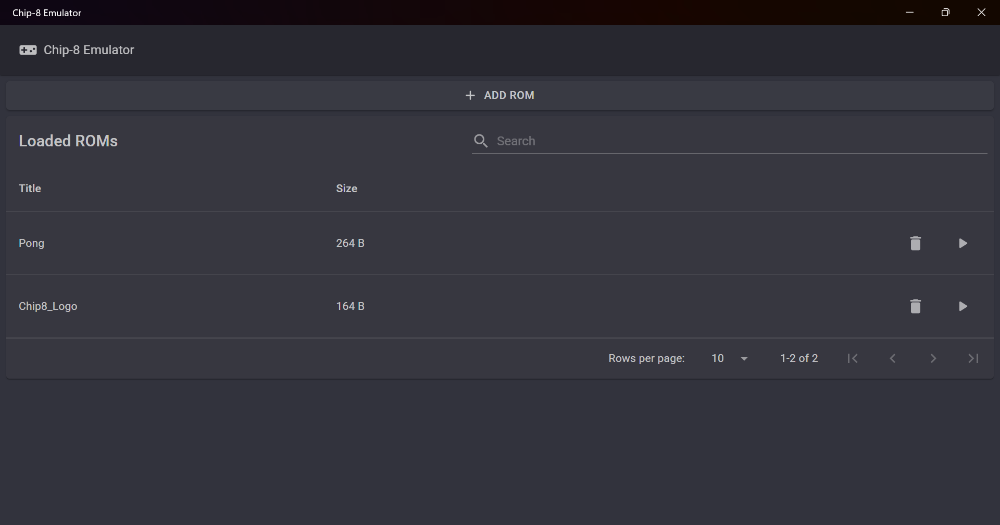
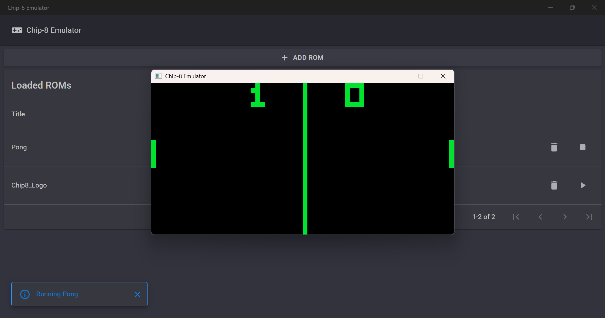
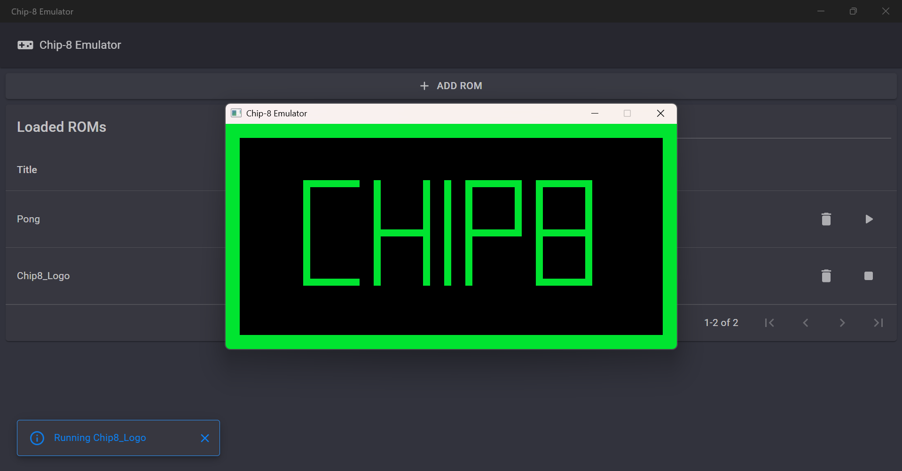

## 🎮 Chip-8 Emulator (C# + MAUI Blazor)
A simple emulator of the classic Chip-8 virtual machine, written in C#, with a graphical interface built using .NET MAUI + Blazor and rendering powered by Raylib.

## 📷 Screenshots

## 💾 ROM Support

The emulator supports **original, unmodified Chip-8 ROMs**.

## 🛠 Tech Stack

* **C#**
* **.NET MAUI**
* **Blazor**
* Raylib (rendering)
